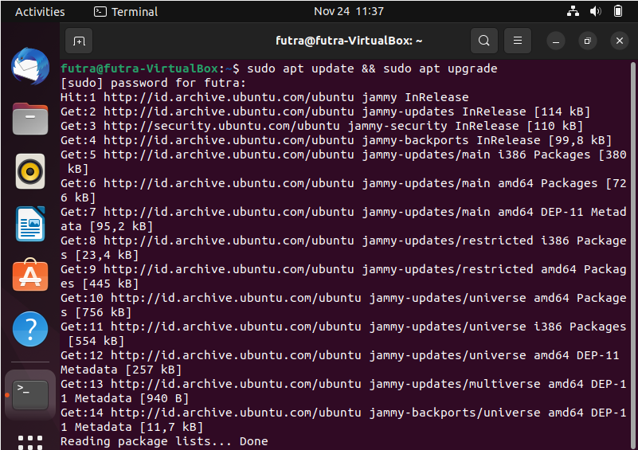
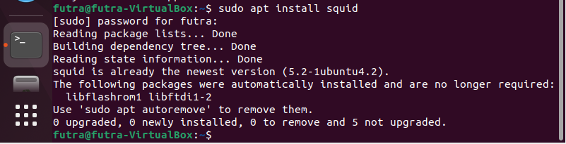
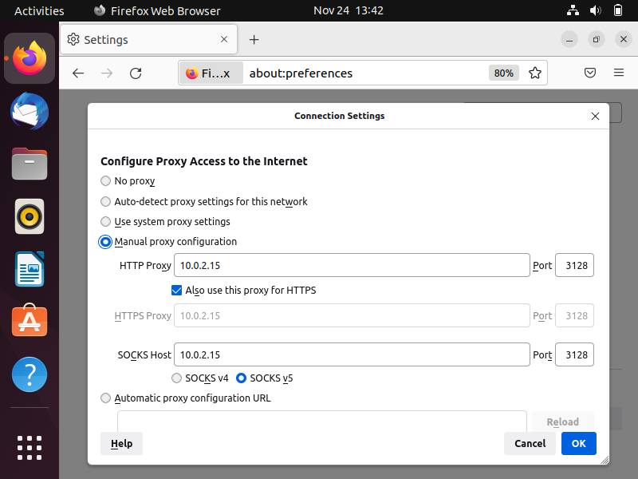
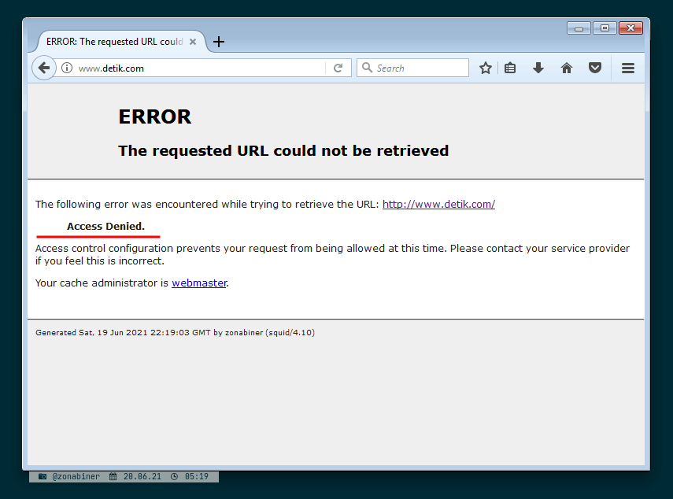
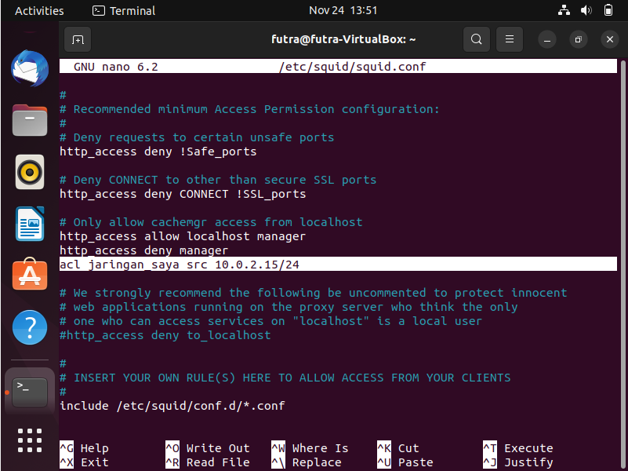
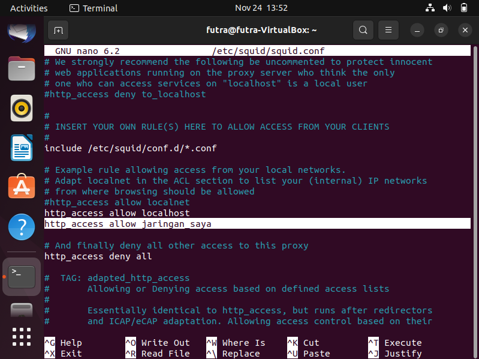
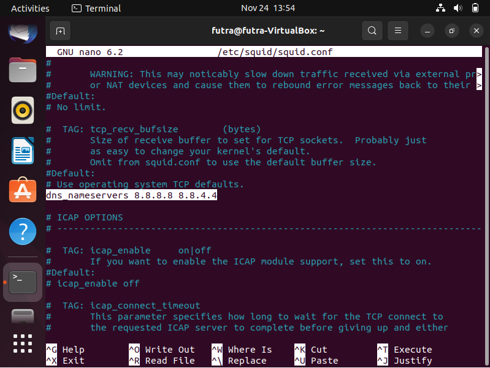
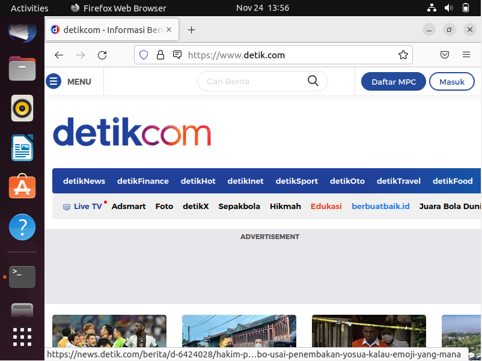

## PROXY SERVER (SQUID)
> **Nama Kelompok:**
> 1. Futra S Hutasoit (2010131210002)
> 2. Reza Maulana (2010131310012)
> 3. Rizky Ahmad (1910131310003)
> 4. Maria Manurung (1910131120004)
> 5. M. Fadil Hidayat (1810131310009)
> 6. Nurdian (1710131210020)

**1. Instalasi**
+ Langkah awal sebelum instalasi paket lakukan update dan upgrade sistem dengan menjalankan command **sudo apt update && sudo apt upgrade**

+ Setelah itu lakukan instalasi squid dengan menjalankan command **sudo apt install squid**. Tunggu proses instalasi hingga selesai.

**2. Settings Browser (Firefox)**
+ Secara default proxy server running pada port 3128. Untuk penggunaan cukup mudah kalian tinggal ganti settingan network pada browser kalian dan arahkan ke alamat proxy server. Setting Proxy ini akan berbeda-beda sesuai dengan browser yang kalian pakai. Untuk konfigurasi proxy pada firefox cukup dengan masuk ke setting kemudian buka network setting,  pilih manual proxy configuration → masukan HTTP Proxy (IP Address Proxy Server) dan Port Proxy (Default 3128).

+ Setelah kita selesai melakukan konfigurasi browser agar memakai proxy server yang kita buat, jika kita mencoba melakukan akses ke laman web maka secara default akan tidak bisa (Access Denied).

**3. Konfigurasi**
+ Untuk melakukan konfigurasi squid kita dapat melakukan edit pada file squid.conf, silahkan jalankan command **sudo nano /etc/squid/squid.conf** agar nantinya kita bisa melakukan akses internet dari web browser. Terlebih dahulu kita lakukan pendefinisian acl (Access Control List) network. Sesuaikan src addressnya dengan network yang akan diperbolehkan untuk menggunakan proxy server. Contoh disini network yang sedang saya pakai adalah 10.0.2.15/24. Untuk mencari baris yang mau kita ubah silahkan menekan Ctrl+w dan ketik **Only allow cachemgr access from localhost** lalu tambahkan yang saya tandai

+ Cari baris **http_access allow localnet** dengan menekan Ctrl+w dan ketik, kemudian tambahkan seperti yang saya tandai

+ Terakhir masih didalam file yang sama, definisikan dns server yang kalian sedang pakai.

+ Jika kalian sudah yakin benar dalam melakukan konfigurasinya, save dan exit lalu restart service squidnya dengan menjalankan command **sudo systemctl restart squid.service** atau **sudo systemctl reload squid.service.**

**3. Pengujian**
+ Setelah semua konfigurasi berhasil dilakukan sekarang saatnya untuk melakukan pengujian dengan cara mengakses laman web yang tadinya tidak bisa diakses atau diblokir.

+ Sekian tutorial kali ini, bagi anda yang berhasil selamat dan bagi anda yang belum berhasil semangat untuk mencari solusi.